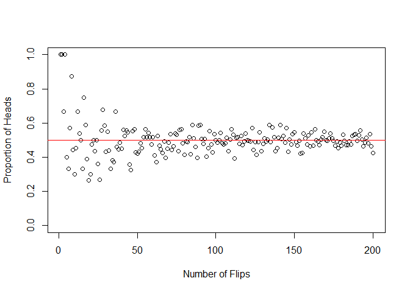
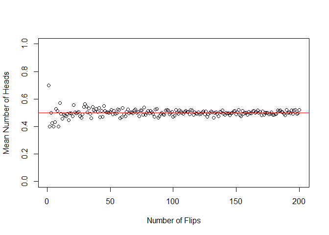
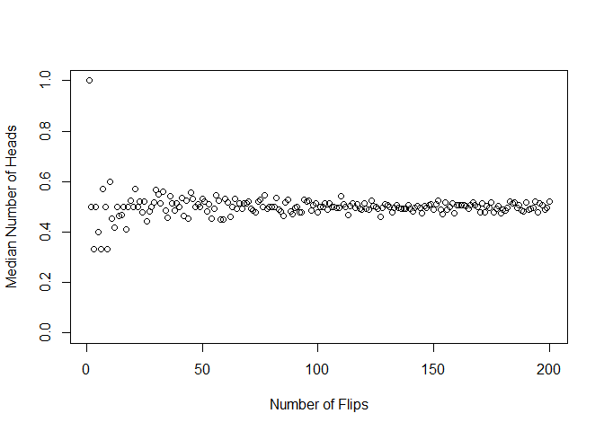
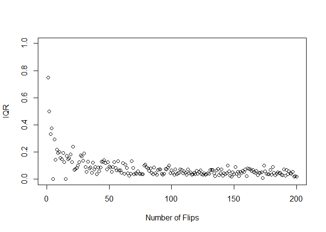
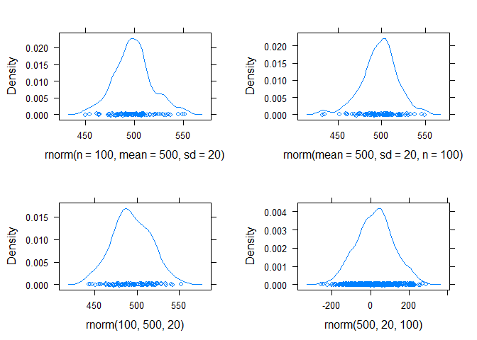

# Week 2 Problem
Daniel Dinsdale  
Wednesday, January 14, 2015  

Here I will simulate experiments of between 1 and 200 coin tosses. I record the proportion of heads within each experiment and plot this against the experiment size.


```r
n <- 1   #number of tests 
m <- 200 #number of trials
p <- 0.5 #probability of success
headPropFull <- NULL
for(m in 1:200){
  numHeads <- rbinom(n, m, p)
  headProp <- numHeads/m
  headPropFull <- c(headPropFull, headProp)
}
plot(x=1:200, headPropFull, ylim=c(0,1), xlab="Number of Flips", ylab="Proportion of Heads")
abline(0.5,0, col="red")
```

 

We can also simulate numerous samples (in this case 10) and calculate the mean, IQR and median of the sample proportions.
   

Here is an example of accepting defaults and the effects of changing argument order.


```r
p1 <- densityplot(rnorm(n=100, mean=500, sd=20))
p2 <- densityplot(rnorm(mean=500, sd=20, n=100))
p3 <- densityplot(rnorm(100, 500, 20))
p4 <- densityplot(rnorm(500, 20, 100))
grid.arrange(p1,p2, p3, p4,nrow = 2, ncol=2)
```

 

In this case, the bottom right panel is not the density obtained from 100 samples of a normal distribution with mean 500 and standard deviation 20, unlike the other 3. This is because the order of the inputs into rnorm was changed but the inputs were not specified.

Now I provide an example of estimating the CDF at a certain threshold. I calculate the CDF at the point 130 for a normal distribution with mean 100 and standard deviation 40.

```r
pnorm(130, 100, 40)
```

```
## [1] 0.7733726
```

Then using 10000 observations, the estimated CDF is...

```r
n <- 10000
sampleNorm <- rnorm(n, 100, 40)
sum(sampleNorm <= 130)/n
```

```
## [1] 0.7769
```

They are roughly the same!

Here is a similar example for the chi-squared distribution with 3 degrees of freedom, using a threshold of 4:

```r
pchisq(4, 3)
```

```
## [1] 0.7385359
```

```r
n <- 10000
sampleChi <- rchisq(n, 3)
sum(sampleChi <= 4)/n
```

```
## [1] 0.7441
```

The approximation is fairly accurate. However if we reduce the sample size to 100 this accuracy is reduced:

```r
pchisq(4, 3)
```

```
## [1] 0.7385359
```

```r
n <- 100
sampleChi <- rchisq(n, 3)
sum(sampleChi <= 4)/n
```

```
## [1] 0.71
```

We could also choose to estimate the probability of values falling above a threshold:

```r
1-pchisq(2, 3) #probability above 2 for a chi-sqaured dist. with 3 df
```

```
## [1] 0.5724067
```

```r
n <- 10000
sampleChi <- rchisq(n, 3)
sum(sampleChi >= 2)/n
```

```
## [1] 0.5641
```

or within a certain interval:

```r
pchisq(5, 3)-pchisq(2, 3) #probability between 2 and 5
```

```
## [1] 0.4006096
```

```r
n <- 10000
sampleChi <- rchisq(n, 3)
sum(sampleChi >= 2 & sampleChi <= 5)/n
```

```
## [1] 0.3938
```
